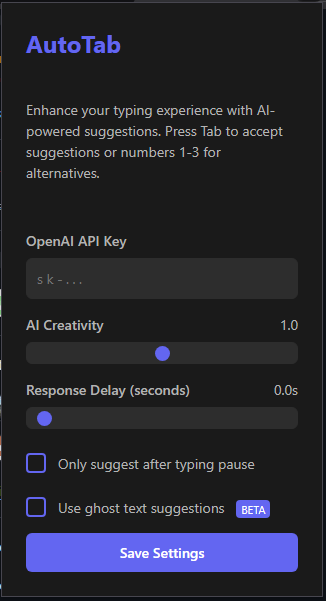

# 🤖 AutoTab

<div align="center">
  

[](https://www.javascript.com/)
[](https://chrome.google.com/webstore)
[](https://openai.com/)
[](LICENSE)
</div>

## Overview
AutoTab is a sophisticated browser extension that provides AI-powered text completion and suggestions in real-time. Built with pure JavaScript and modern browser technologies, it offers a seamless, GitHub Copilot-like experience for any text input field. The extension uses advanced context awareness and intelligent word tracking to provide accurate and relevant suggestions as you type.

The platform features both ghost text (inline) and tooltip-based suggestions, with support for multiple alternatives and intelligent space handling. It's designed to work across various text editors and input fields, making it a versatile tool for any text input scenario.

## ✨ Features

### Core Functionality
  - Pure JavaScript Implementation (No dependencies)
  - Real-time AI Completion
  - 👻 Ghost Text Preview (Like GitHub Copilot)
  - Context-Aware Suggestions
  - Multi-Word Completion
  - ⌨️ Tab to Complete
  - Alternative Suggestions (1-3 keys)

### Smart Word Tracking
  - Last Complete Word Tracking
  - Partial Word Detection
  - Multi-word Context Maintenance
  - Intelligent Space Handling
  - Cursor Position Awareness

### 🎨 UI Features
  - Dark/Light Mode Support
  - Smooth Animations
  - Responsive Tooltip Positioning
  - System Theme Integration
  - Ghost Text Preview
  - Alternative Suggestions Display

### 🔌 Editor Integration
  - Standard Input Fields
  - Contenteditable Elements
  - Monaco Editor Support
  - CodeMirror Support
  - Rich Text Editors:
    - Quill
    - ProseMirror
    - TinyMCE
    - CKEditor
    - Froala
    - Medium Editor

### Context Awareness
  - Input Field Context
  - Nearby Text Analysis
  - Form Context Understanding
  - Page Metadata Integration
  - Label & Placeholder Analysis

## 🚀 Installation

### Prerequisites
- Chrome/Chromium-based browser
- OpenAI API Key

### Extension Setup
1. Clone the repository:
```bash
git clone https://github.com/LordZEDIth/AutoTab.git
cd AutoTab
```

2. Load the extension in Chrome:
- Open Chrome and navigate to `chrome://extensions/`
- Enable "Developer mode"
- Click "Load unpacked"
- Select the cloned repository folder

3. Configure the extension:
- Click the extension icon
- Enter your OpenAI API key
- Adjust settings as needed

## ⚙️ Configuration

### AI Settings
- **Creativity Level**: Adjust the temperature of AI responses (0.0 - 2.0)
- **Response Delay**: Set the debounce time for suggestions (0.0s - 2.0s)
- **Ghost Text Mode**: Toggle between ghost text and tooltip display
- **Typing Pause**: Enable suggestions only after typing pause

### Debug Settings
- Enable detailed console logging
- Track word analysis
- Monitor completion processing
- View API response details

## Performance

### Optimization
- Efficient DOM manipulation
- Smart suggestion caching
- Minimal reflows/repaints
- Debounced API calls

### Space Handling
- Intelligent multi-word completion
- Context-aware space insertion
- Cursor position preservation
- Format maintenance

### 🔒 Security
- Secure API key storage
- Request validation
- Safe content injection
- XSS prevention

## 📦 Recent Updates

### Version 1.1.0
- Improved word completion logic
- Enhanced partial word detection
- Added type-through functionality
- Refined UI animations
- Smarter space handling
- Better alternatives display

### Version 1.0.0
- Initial release
- Basic completion functionality
- Ghost text implementation
- Tooltip-based suggestions
- Editor integration

## Contact
For questions and support, please open an issue in the GitHub repository or contact me directly.

## License
This project is licensed under the MIT License - see the [LICENSE](LICENSE) file for details. 